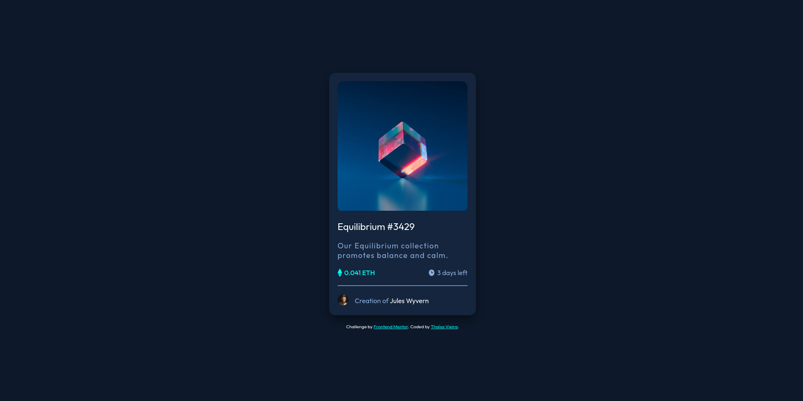

# Frontend Mentor - NFT preview card component solution

## Welcome! 👋

Thanks for checking out my front-end coding challenge. My goal is to practice my CSS skills, especially the correct use of flexbox techniques.
If you'd like to test your Front-End knowledge, please, check [Frontend Mentor](https://www.frontendmentor.io) challenges that help you improve your coding skills by building realistic projects.
This is a solution to the [NFT preview card component challenge on Frontend Mentor](https://www.frontendmentor.io/challenges/nft-preview-card-component-SbdUL_w0U). 

## Table of contents

- [Overview](#overview)
  - [The challenge](#the-challenge)
  - [About Styles](#about-styles)
  - [Screenshot](#screenshot)
  - [Links](#links)
- [My Process](#my-process)
  - [Built with](#built-with)
  - [What I Learned](#what-i-learned)
- [Author](#author)

## Overview

### The Challenge

The challenge was about build out this preview card component and get it looking as close to the design as possible.

The users should be able to:

✅ View the optimal layout depending on their device's screen size;

✅ See hover states for interactive elements;

## About Styles
My task was to build out the project to the designs inside the `/design` folder. The designs are in JPG static format. Using JPGs will mean that I used my best judgment for styles such as `font-size`, `padding` and `margin`. Also information such as color palete and fonts can be found in `style-guide.md`.

### Screenshot

### Links

- Solution URL: [Repository](https://github.com/thaisavieira/nft-preview-card-component)
- Live Site URL: [Deploy](https://thaisavieira.github.io/nft-preview-card-component/)

## My process

You can read about my process of building this project on my blog:[NFT Preview Card Component Challenge from Frontend Mentor](https://dev.to/thaisavieira/nft-preview-card-component-challenge-from-frontend-mentor-2471)

### Built with

- Semantic HTML5 markup;
- CSS custom properties;
- Flexbox.

### What I Learned

The most challenge part to me was  at the `.produt-image` hover. When the user hovers over the element it changes to image opacity, adds a background color, and shows an icon on top of the product image, so it's a little bit more complex and requires more attention and understanding of properties such as position, overflow, opacity, transition and the `::after` selector. 

## Author

- DEV Community (blog) - [Thaísa Vieira](https://dev.to/thaisavieira)
- Frontend Mentor - [@thaisavieira](https://www.frontendmentor.io/profile/thaisavieira)
- Mastodon - [@thaisavieira](https://techtoots.com/@thaisavieira)

